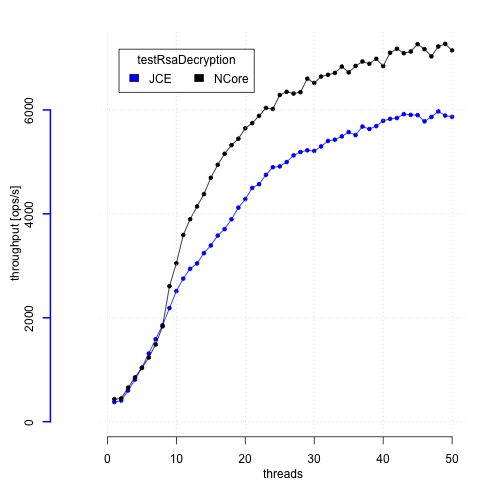

# chro·no·stream

## About

Crypto microbenchmarking tool. Replaces [the v1](https://github.com/alokmenghrajani/chronostream/tree/master/src/main/java/chronostream).

Uses JMH to gather data and R to plot. JMH gives us some nice features, such as being able to run only a
subset of tests.

## Running

    mvn package
    java -cp /opt/nfast/java/classes/nCipherKM.jar:./chronostream-2.0.jar org.openjdk.jmh.Main -f 1 -t 20 -rff output

## Testing
To quickly run the code:

    mvn package
    java -cp ./ncipherkm-1.0.jar:target/chronostream-2.0.jar org.openjdk.jmh.Main -wi 0 -f 1 -i 1 -r 1

## Generating graphs

    R --vanilla < render_results.R

## Links worth reading
(in no particular order)
* http://www.oracle.com/technetwork/articles/java/architect-benchmarking-2266277.html
* https://daniel.mitterdorfer.name/articles/2014/benchmarking-digging-deeper/
* https://groups.google.com/forum/#!msg/mechanical-sympathy/m4opvy4xq3U/h-n4eNw2SmoJ
* http://tutorials.jenkov.com/java-performance/jmh.html#writing-good-benchmarks
* http://openjdk.java.net/projects/code-tools/jmh/
* http://www.baeldung.com/java-microbenchmark-harness
